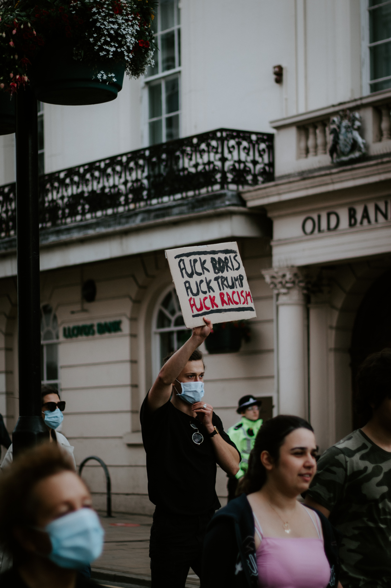
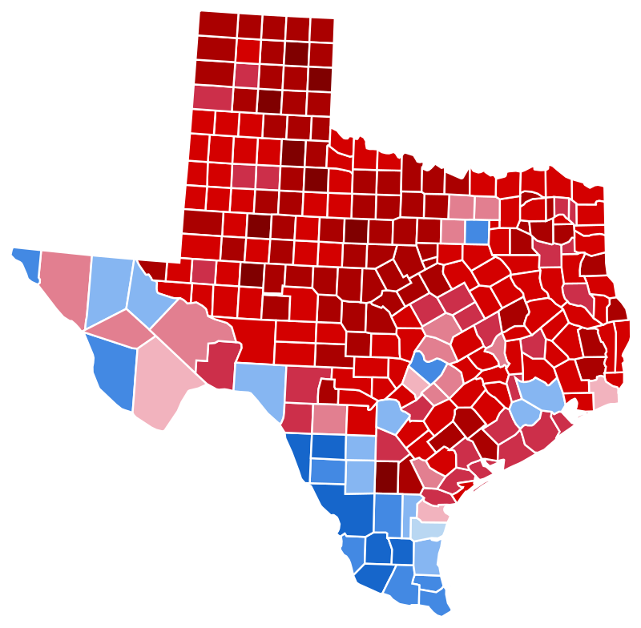

# A worrying political context

At a time of the _Black Lives Matter_ movement, the denunciation of police violence in many countries, with a change of president of the USA approaching, we have decided to take a closer look at the police arrests in the USA. What we want to know is: is there a racist bias in police stops in the US ? If so, what link could it have with the political inclination of the region studied ?

Today, we study the police behaviour as a barometer of prejudices toward different ethnic origins. No need to tell you that any correlation with a political inclination would be even more questioning about the values spread by certain political parties...

# Let's quantify racial bias
## What data are we looking at ?
For this study we used a dataset of **100 million traffic stops** across the United States, with various time ranges for each state. We also compare this data with the [New York Times website](https://www.nytimes.com/elections/2016/results/president), which reports the results to the **US presidential elections of 2016**.

## Is racial bias measurable ?
This is difficult to quantify because many parameters are subjective. This is why we are interested in car stops and the potential searches to which they lead. This makes it possible to study uniform and more concrete characteristics: location, reason for the arrest, decision to search, "success" of the search, and colour of the driver.
We focus on two parameters:
- the **hit rate**, the "success" rate of searches for drug possession during police arrests. 
A lower hit rate may indicate that the police officer initiated a search with less evidence, which may be biased by the colour of the driver's skin.  
- the **threshold**: the level of evidence necessary for the police officer to decide to search someone.
If it is lower, it may also show a bias on the part of the police officer.
.
After counting these parameters we will **compare the results between red and blue states** !

# Comparing red and blue states
## Which states and why ?
Selecting which state to represent requires multiple steps. 
First of all, not all states have all of the required information for our study, that is the calculations of hit rate and threshold test. This first narrows us down to the states of: **_Connecticut, Illinois, North Carolina, Rhode Island, South Carolina, Texas, Washington, and Wisconsin_**. 
Now, let's select states that seem to be most significant: that is, the ones that had the highest percentage of votes for the party that won. This takes out North Carolina, which had a major percentage very close to 50%. Finally, we took out Wisconsin, since it tends to be a swing state.

This divides our 6 remaining states into two groups: South Carolina and Texas in the red group, and Illinois, Connecticut, Rhode Island and Washington in the blue group.

## Data vizualization 

Before plotting our rates, we first want to check if our dataset is big enough: are there enough police stops and searches for our results to be significant? The results are in the following table: 

| State group | Number of stops per year | Number of searches per year|
| :------ |:--- | :--- |
| Red | 2 104 964.4 | 47 958.6 |
| Blue | 1 071 249.6 | 29 642.0 |

Okay, we're talking _millions_ of data points. Looks big enough! Let's proceed with our plots for hit rates and threshold tests.

## Hit rates and threshold in blue states compared to red states

Let's have a first look at our data through the following visualization:

{: .mx-auto.d-block :}

Here we _normalized_ black and hispanic hit rates in each state to the respective white hit rate. That allows to have only numbers between zero and one and visualize in a clearer way the difference between them. Also, a state could have only low hit rates for every ethnic origins, without this indication more or less discrimination.

- Can you see how **all thresholds** (_right plot_) **for minorities are lower than the one for white drivers** ?
- It's almost **the same for the hit rates** (_left plot_) ! Can you spot the two states that make an exception ? (it's Illinois and South Carolina)
- All **parameters for hispanic drivers are lower than for black drivers**, with a few exception where they're the same (hit rate in Connecticut, threshold in Connecticut and Illinois)

But ... Can we **_really_** see a difference between red and blue states here ?

Now, let's look at the **distribution** of these findings. We plot a parameter for a minority (_ex. the hit rate for black drivers_) against the one for white drivers. **The ratio minority/white should be 1** if there is no disparity, with a point on the plot at the level of the diagonal we plot. See the results here:

{: .mx-auto.d-block :}
{: .mx-auto.d-block :}

Oops, can you see how **the majority of the points are below the diagonal**, with a particulary long distance in the threshold plot in blue states (_left plot, below_).

More generally, we can observe that: 
- there are clearly more points below the diagonal than on and above it
- for the **hit rates, it doesn't matter if you're in a blue or red state**: hispanic drivers are even further below the diagonal than for black drivers. This means that **searches on hispanic drivers have lower relative hit rates** than the ones on black drivers.
- for the **threshold**: in **red states**, we observe the same pattern, with **lower threshold for hispanic drivers** than for black drivers. In **blue states** however, we observe the **same disparity for both race**.

But be careful: there are a large amount of points in red states and far less in blue states, which can trouble and bias visualization. Note that the size of the points correspond to the number of police search per year for this race in the county considered

As a conclusion : **Non-Caucasian drivers have lower values for hit rates and threshold, in _all_ color of state, than white drivers. Moreover, this gap widens even more for hispanic drivers** !

## Statistics
### Tableau avec normalized and weighted mean:
<table>
<tr><th>Blue </th><th>Red</th></tr>
<tr><td>
 
| |Black|Hispanic|White|
| :------ |:--- | :--- | :--- |
| Hit rate, normalized | 0.960909 | 0.698504 | 1 | 
| Hit rate, weighted and normalized | 0.908968 | 0.689212	|1 |
| Threshold, normalized | 0.704567 |0.631549 |1 |
| Threshold, weighted and normalized | 0.571677|0.618790| 1 |

</td><td>

| |Black|Hispanic|White|
| :------ |:--- | :--- | :--- |
| Hit rate, normalized | 0.960909 | 0.698504 | 1 | 
| Hit rate, weighted and normalized | 0.908968 | 0.689212	|1 |
| Threshold, normalized | 0.704567 |0.631549 |1 |
| Threshold, weighted and normalized | 0.571677|0.618790| 1 |

</td></tr> </table>

## Our first observations
Oops. Apparently there is a significant difference according to our statistical tests. But it's not obvious! How can we sharpen our study?
The election results we used are state-wide. As they cover a very large population and a very large number of counties, they average and homogenize the results ! For example, a **blue county within a red state will distort our correlation study**. In order to have more accurate results and more representative percentages of the population in each county, we will study blue counties VS red counties, and we will use the results **county by county**.

# Let's take a closer look !
## Texas counties: blue and red repartition
As a start, here's a map of election results in Texas, each portion being a county. See how many blue counties there are even when Texas is a traditionnal red state ?
Also, note that big cities tend to be located in blue counties, whereas more rural areas represent red counties. Dallas is the little blue squared, isolated amoung red ones in the top right region !

Let's look at how the hit rate and threshold repartition changes based on the county color.

Once again, we are looking at large numbers of police stops - no worries for the significancy of our results ! See by yourself : 

| Texas county group | Number of stops per year | Number of searches per year|
| :------ |:--- | :--- |
| Red | remplir | remplir |
| Blue | remplir | remplir |

## Comparison of red and blue counties
Following we have the equivalent of the previous plots, but at the Texas level, where the points take the color of the county, not of the state:
{: .mx-auto.d-block :}
{: .mx-auto.d-block :}

## Our observations

First, let's specify that we have clearly _too few points_ in blue states to allow a global visualization and obvious conclusion drawing from these plots. But still, we can make a few observations :
About disparities : 
- **a disparity remains between black and hispanic drivers**, with hispanic hit rates and thresholds further from the diagonal than black ones. **This is seen in county groups** and for all parameters.
- some relative hit rates and thresholds for black drivers are even above the diagonal, but almost none for hispanic drivers

About red and blue differences:
- Red counties tend to have very spread pointsand some are really far below the diagonal. In the blue states we don't see points that far away.
- Blue counties points are not numerous, but some represent a large numbers of police searches. Their repartition is globally close to the diagonal.
- all parameters seem to be higher in red counties, even for white drivers: the dots are located in the middle of the diagonal, with no dot close to the origin. Why is that ? We will try to answer this question at the end of our data story.

## Stats sur les counties

 
## Investigation of other parameters: Trucs que louis a fait sur taille des county et hit rates inversement correlées
What if other parameters comes into play ? Blue counties are also where cities take place. Apart from their political orientation in which they usually differ from the countryside, other parameters are to be taken into account. For example, there are more police stops there. What links the number of police stops and the hit rates and threshold for police searches ?

AJOUTER FINDINGS de LOUIS

It seems that the hit rates and threshold are in fact inversly correlated to the number of police stops ! What if police officers, after arresting many people, were more inclined to search drivers for an unknown reason ?

# Can we conclude anything ?
## What we cannot say
Don't draw conclusions too quickly !

It is very important to remember that we are only _observing_ certain characteristics. They have certainly been chosen because they allow a quantification of clear parameters that can be linked to, among other things, the race of the driver. 
However, **it is important to remember that this is an observational study** and not an experiment: we do not know all about the environment in which these arrests took place, nor the various parameters that could have affected them - even though we thought of some. **We point out that disparities in these parameters seem correlated to the race of the driver**, but **we do not establish a causal link**, due to the lack of a sufficiently rigorous and varied investigation (historical and political context, sociological study, comparison with other countries, comparison with other types of police intervention, etc.) to conclude in this way.

## What we can say ...
### Clear conclusions on Non-Caucasian drivers hit rates and thresholds
#### lower for non caucasian
as stated in [.....] link to the paper
#### even lower for hispanic drivers
...

### No clear conclusion about state major political party
Although the averages of the normalised parameters are lower in the red states than in the blue states (found thanks to the Mann-Whitney test), the distributions are not obviously different between the two groups of states. Our data and therefore our results remain heterogeneous and have no clear trend according to the colour of the state. As the states include a large number of counties that are themselves very various in terms of police stops and political orientation, we cannot base our study on the state level. If there is a correlation, it is normal that it is not or hardly visible at this level. We have to look at the counties to find out more !

### possible conclusion sur les counties
 ???? 

# References
- paper
- elections
- ...

# Thanks for your attention ! 
